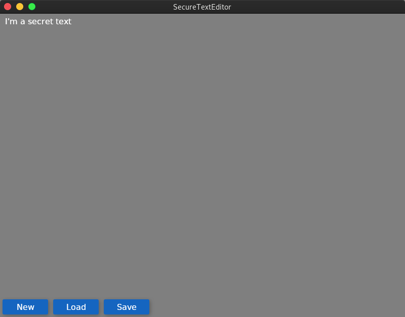
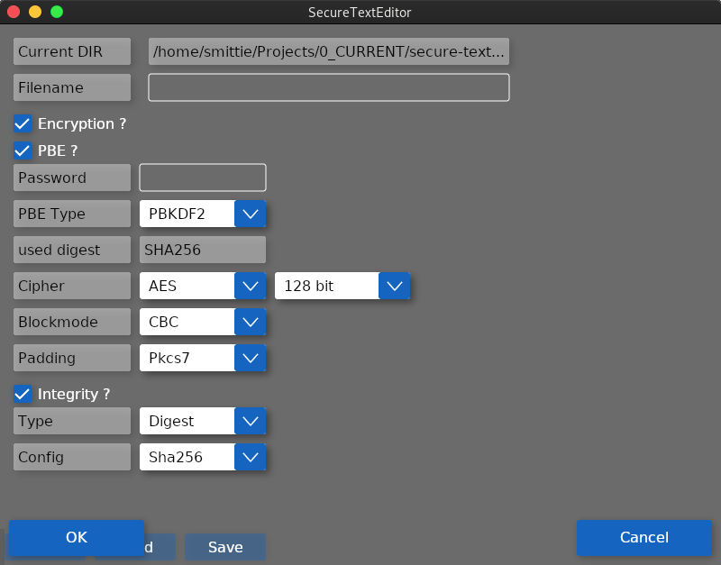
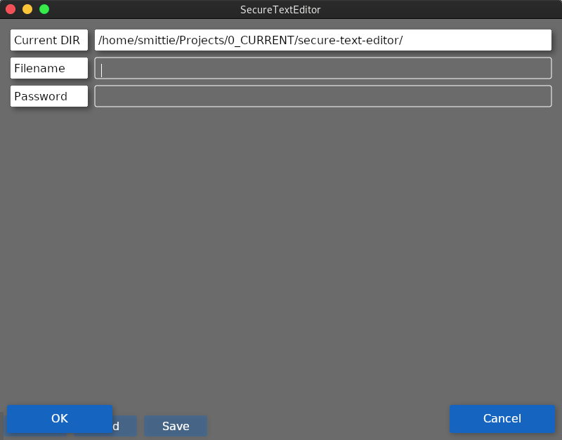

# secure-text-editor

Implementation of a basic text editor with security features in C# which can save and load it's own encrypted files or any other basic text file.

All cryptographic functionality was used with [bouncyCastle](https://github.com/bcgit/bc-csharp) crypto library.

The used cross-plattform UI library _medja_ has been provided by [SprintWORX GmbH](https://sprintworx.de/).

Under the hood _medja_ uses OpenTK and SkiSharp and has been created as a lightweight cross-plattform UI library especially for embedded systems applications. This project is some sort of prototype test in an different environment.
Therefore it's not fully optimized for this use case but still feature-rich enough to run the editor under Linux, OSX and Windows.

Because openTK hasn't been ported to a current dotNet standard yet the _secure-text-editor_ currently runs with the mono runtime.

_medja_ isn't open sourced right now but might be in the future, till then it's not possible to build the project without a private feed.
Due to the design of the _secure-text-editor_ project it's easy to use a different UI framework or library and just make use of the crypto backend.



The project currently provides the following cryptographic options:

| Cipher | Keysize             |
| ------ | ------------------- |
| AES    | 128 / 192 / 256 bit |
| RC4    | 40 - 2048 bit       |

| Blockmode |
| --------- |
| ECB       |
| CBC       |
| OFB       |

| Padding   |
| --------- |
| NoPadding |
| PKCS7     |
| ZeroByte  |

| PBE (Password based encryption) cipher |
| -------------------------------------- |
| PBKDF2                                 |
| SCRYPT                                 |

| Digital Signing (creation and verification) |
| ------------------------------------------- |
| SHA256 with DSA                             |

| Digest and MACs |
| --------------- |
| SHA256          |
| AESCMAC         |
| HMACSHA256      |





The editor stores text files in a json file format:

```
{
  "FormatVersion": "0.1",
  "Encoding": "System.Text.UTF8Encoding",
  "IvOrSalt": null,
  "Signature": null,
  "Cipher": "1irNqq2d6jX/PDGoNqBvAg==",
  "IsEncryptActive": true,
  "CipherAlgorithm": "AES",
  "KeySize": 128,
  "BlockMode": "ECB",
  "Padding": "Pkcs7",
  "IsPbeActive": false,
  "PbeAlgorithm": "PBKDF2",
  "PbeDigest": "GCM",
  "IsIntegrityActive": false,
  "Integrity": "Digest",
  "IntegrityOptions": "Sha256"
}
```

There is also some sort of code documentation via doxygen.
To create it, `cd` to the project root and execute `doxygen` via CLI. (Doxygen looks for it's config file in the current directory if not specified.)
